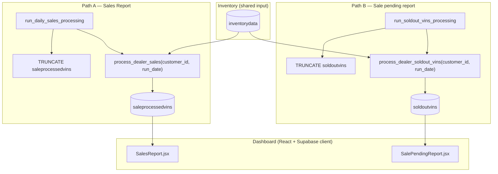
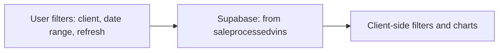
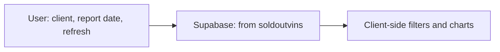
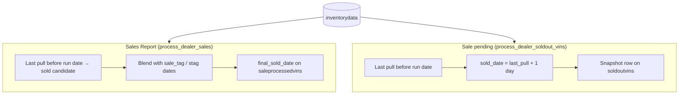

# Sales Report vs Sale pending report — data flow

This document explains how the two dashboard reports get their data, from inventory through Postgres functions to the React UI.

## Quick comparison

| | **Sales Report** (`/sales-report`) | **Sale pending report** (`/sale-pending-report`) |
|--|--|--|
| **Source table** | `saleprocessedvins` | `soldoutvins` |
| **Primary date column** | `final_sold_date` | `sold_date` |
| **UI date control** | Date range (from / to) | Single **report date** (default: today) |
| **DB builder** | `process_dealer_sales` | `process_dealer_soldout_vins` |
| **Sale-tag / staging logic** | Yes (`sale_tag`, `stag_first_date`, `days_delay`, blended `final_sold_date`) | No — inventory “drop-off” only |
| **Typical full rebuild** | `run_daily_sales_processing()` (truncates `saleprocessedvins`, then per active client) | `run_soldout_vins_processing()` (truncates `soldoutvins`, then per active client) |

Both pages read **`clients`** for the dropdown, respect **assigned clients** for non-admin users, and aggregate/filter in the browser (condition, make, type, location, year, charts, VIN table).

---

## End-to-end overview

---

## Path A — Sales Report

### What “sold” means in the database

`process_dealer_sales` (see `supabase/migrations/20260312000001_master_sale_rpc.sql`, and the logged variant in `20260315000011_process_dealer_sales_debug_log.sql` if applied) builds rows from **`inventorydata`** for one `customer_id` and **`p_todate`** (usually **current date** when the daily job runs).

Roughly:

1. **Actually sold (inventory drop-off)**  
   For each VIN, take **max(`pull_date`)** for that dealer. If it is **strictly before** `p_todate`, the vehicle is treated as no longer in inventory for “today.”  
   - **`sold_date`** = day **after** that last `pull_date`.  
   - If **`sale_tag`** exists on historical rows, **`stag_first_date`** and related fields are used to compute **`days_delay`** and **`final_sold_date`** (can be earlier than raw `sold_date` when staging is present).

2. **Sale-tag-only rows**  
   VINs that **still appear** on `p_todate` but carry a **`sale_tag`** can be inserted as separate rows with staging-driven **`final_sold_date`** (second insert in the same function).

The function **INSERT**s into **`saleprocessedvins`** (wide row: VIN, pricing, attributes, `final_sold_date`, etc.).

### Orchestration

- **`run_daily_sales_processing()`** — truncates **`saleprocessedvins`**, loops **active clients** (`is_active`), calls **`process_dealer_sales`** per client. Often scheduled via **pg_cron** in your project; the Edge Function `daily-sales-processor-dealer-wise` currently only returns SQL hints (see `supabase/functions/daily-sales-processor-dealer-wise/index.ts`).
- Queue-based flows may use **`enqueue_daily_sales_processing`**, **`sales_processing_queue`**, and related migrations — same underlying **`process_dealer_sales`**.

### UI: `SalesReport.jsx`

- **Query:** `select *` from **`saleprocessedvins`** where **`final_sold_date` is not null**, optional **`customer_id`**, **`final_sold_date`** between **dateFrom** and **dateTo**.
- **Refresh:** reloads **clients** + **sales** in parallel.

---

## Path B — Sale pending report

### What a row means

`process_dealer_soldout_vins` (see `supabase/migrations/20260328140000_soldout_vins_processing.sql`) mirrors the legacy Django “sold-out from inventory” job:

- For each VIN for a dealer, **max(`pull_date`) &lt; `p_todate`** ⇒ treat as sold out for that run.  
- **`sold_date`** = **next calendar day** after that last `pull_date`.  
- Snapshot fields come from the **latest** `inventorydata` row for that VIN (same dealer), **`ORDER BY pull_date DESC`**.  
- **No** `sale_tag` / staging step — different from Path A.

Inserts go only into **`soldoutvins`** (table created in `20260328130000_soldoutvins.sql`).

### Orchestration

- **`run_soldout_vins_processing()`** — **`TRUNCATE soldoutvins`**, then for each **active** client calls **`process_dealer_soldout_vins(id, CURRENT_DATE)`**.  
- **Scheduling:** not bundled with the same cron as daily sales in the migrations shown in-repo; run manually or add **pg_cron** / Edge hook when you want daily parity.

Helpers: **`truncate_soldoutvins()`** if you only need to clear the table.

### UI: `SalePendingReport.jsx`

- **Query:** **`sold_date` = `reportDate`** (default **today**, local **`YYYY-MM-DD`**), optional **`customer_id`**, assigned-client restriction for non-admins.
- **Refresh:** reloads **clients** + **report** in parallel.

---

## Side-by-side logic (same inventory, different rules)

So the **same VIN** can appear in **both** tables with **different dates or only in one path**, depending on `sale_tag` handling and timing of jobs.

---

## Files to open in the repo

| Area | Location |
|--|--|
| Sales Report UI | `src/pages/SalesReport.jsx` |
| Sale pending UI | `src/pages/SalePendingReport.jsx` |
| Sales RPC | `supabase/migrations/20260312000001_master_sale_rpc.sql`, `20260315000011_process_dealer_sales_debug_log.sql` |
| Daily run / queue | `supabase/migrations/20260328120000_enqueue_daily_sales_all_active_clients.sql`, `20260315000002_daily_sales_processing_trigger.sql`, `20260315000004_sales_processing_job_queue.sql` |
| Sold-out table | `supabase/migrations/20260328130000_soldoutvins.sql` |
| Sold-out processing | `supabase/migrations/20260328140000_soldout_vins_processing.sql` |

---

## Viewing the diagrams

- **GitHub / GitLab** render Mermaid in markdown preview.  
- **VS Code / Cursor:** use a Mermaid preview extension if the built-in preview does not draw diagrams.

If you want this wired to a specific **pg_cron** schedule for `run_soldout_vins_processing`, that can be added as a follow-up migration.
